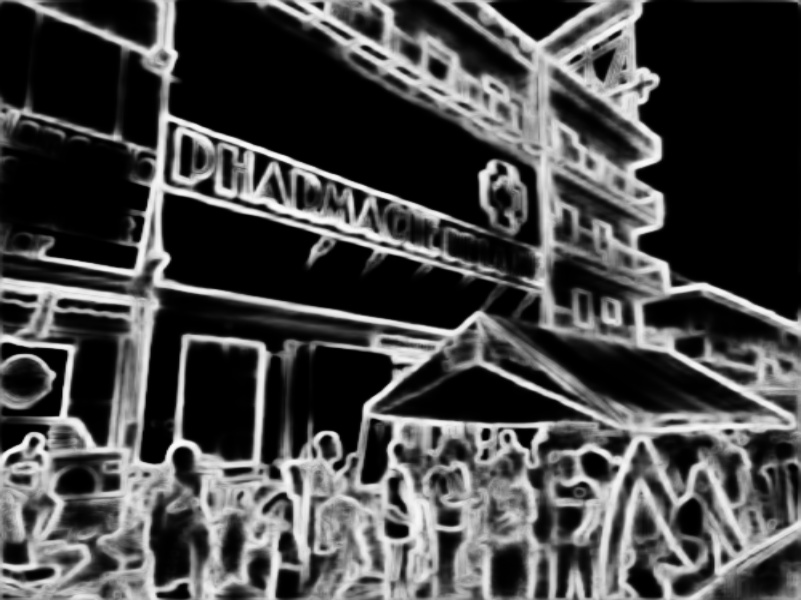
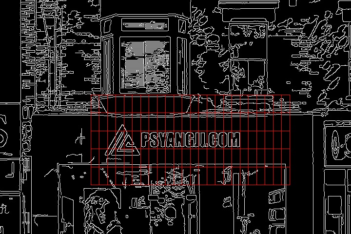

# ASCIIArt
Converting an RGB signboard image to its ASCII encoding within 140 characters

## Structure
```
ASCIIArt
├── edge_detection                          // Edge detection module
│   ├── images                              // Images
│   │   ├── input.jpg                       // Input image
│   │   ...
│   ├── models/hed                          // Pretrained models
│   │   ├── hed_pretrained_bsds.caffemodel  // model parameters
│   │   ├── deploy.prototxt                 // model architecture
│   ├── hed.py                              // Holistically-Nested Edge Detection
│   └── canny.py                            // Canny
├── ocr                                     // OCR module
│   ├── images                              // Images
│   │   ├── hed.jpg
│   │   ...
│   ├── ocr.py                              // PaddleOCR
│   ├── utils.py                            // Some useful fonctions
│   └── README.md                           // Documentation of the OCR module
├── theme_color                             // Theme color extraction module
│   ├── images                              // Images
│   │   ├── roi.jpg                         // input
│   │   └── theme_color.png                 // output
│   ├── color.py                            // KMeans color clustering code
│   └── README.md                           // Documentation of the color extraction module
├── ascii                                   // ASCII matching module
│   ├── images                              // Images
│   │   ├── hed.jpg
│   │   ...
│   ├── fonts                               // Fonts
│   │   └── Menlo.ttc                       // Menlo monospace font       
│   ├── results                             // Converting results
│   │   ├── whole.txt                       // ASCII encoding of the whole image
│   │   ├── limit.txt                       // ASCII encoding of the ROI
│   │   ...                  
│   ├── ascii.py                            // Core code
│   ├── metrics.py                          // Different metrics for patch similarity
│   ├── search.py                           // Search of different segmentation configuration
│   └── README.md                           // Documentation of the ASCII matching module
├── README.md                               // Documentation of the whole project
...
```

# Example

Here is one example of our system.

This is the input image, downloaded arbitrarily from [internet](https://www.psyangji.com/15209.html)


The module of edge detection gives us



The module de OCR gives us


and the text content in the command line

```bash
[[[288.0, 268.0], [491.0, 268.0], [491.0, 305.0], [288.0, 305.0]], ('PSYANGJI.COM', 0.97459394)]
```

Based on these informations, we can do an image segmentation to get the image patches



The ASCII matching module can do the best match for each patch, yielding the final ASCII encoding result

```
  | F      ▕_ ,,, ,,, ▕   ╲      Γ      
  ! L      ▕B| .   .┤∫@    2'  ▕Γ       
  !         F∫│     []@    |┐   Γ       
  │         F|│     |]H    q"  ▕L       
  ]         L|│     []@    |_  j]       
  │ L      ⌒Γ``"""""``▕M   M==∽%8      ,
n ├W"""""""""^^     ^^"""""""""^"""""M"C
@ ├@         ╭┘╲  PSYANGJI.COM       | ┴
  ]Q     ―  ▕~──┴                    ╰ p
  │▕  ▕E    ┴,―' ▕E╰┴┴―E┤ ▕@Γ' ′`▕'  ▕ P
――┤▕  ▕@ ▕g>⌒Wy _▕△_ _H@╯  E   │╭={  ▕ `
. │▕  ▕ш▕▕M   ]┌'' ▕⌒,▕@   "p ,│1―I  ▕ │
```

## TODO

* Modularization

