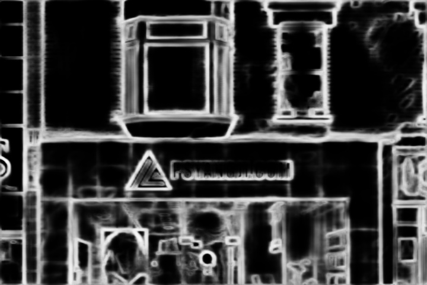

# ASCII Matching Module

Structure based ASCII art. This module includes the following sub functions : rasterize printable ASCII characters, segmente the original image to small patches and match each patch with its most similar character, which depend on the criterion of similarity. 

## Environment Requirement

* pillow
* numpy
* opencv

Note: To get better visualization result, you may need to display the .txt content in a monospaced font.

## Usage

The code is implemented mainly in ascii.py. To use it, you need to set manually

* Path of the image (structure map)
* Text results extracted by OCR module
* Size parameters

## Result

The original image is 


Performing edge detection  via HED, we get the following structure map



The ASCII encoding of the whole image is, using the SAD criterion, as follows

```
  | F      ▕_ ,,, ,,, ▕   ╲      Γ      
  ! L      ▕B| .   .┤∫@    2'  ▕Γ       
  !         F∫│     []@    |┐   Γ       
  │         F|│     |]H    q"  ▕L       
  ]         L|│     []@    |_  j]       
  │ L      ⌒Γ``"""""``▕M   M==∽%8      ,
n ├W"""""""""^^     ^^"""""""""^"""""M"C
@ ├@         ╭┘╲  PSYANGJI.COM       | ┴
  ]Q     ―  ▕~──┴                    ╰ p
  │▕  ▕E    ┴,―' ▕E╰┴┴―E┤ ▕@Γ' ′`▕'  ▕ P
――┤▕  ▕@ ▕g>⌒Wy _▕△_ _H@╯  E   │╭={  ▕ `
. │▕  ▕ш▕▕M   ]┌'' ▕⌒,▕@   "p ,│1―I  ▕ │
```

The text resolution is 12x40, yields 640.


Furthermore, if we need to restrain the number of characters to 140, which is the limitation of a SMS. We should only look at the region of interest extended from the text box, i.e.


And we segment the image starting from the text region, visualized by the following figure. You may observe that almost each character is delimited by a rectangle box


By matching each patch (red rectangle box) with its best matching ASCII character, we can get the following result

```
_╲         ▕Γ___"_^^^Y__
 ``,_              ``   
  ╱'^,,PSYANGJI.COM     
,╱""^"     ,__,,,,, ,,  
 ′1   ▕E ′^eE┤ ▕U     ',
```

The text resolution is 5*24, yields 120.

The result is not as appeling in contrast to the result of 640 resolution, mainly to blame the patch segmentation. Another approach is to perform high resolution matching, and do a sub sampling to extract the region of interest with in 140 character. The key is to identify the position of text and logo in the ASCII encoding. 

## TODO

* ASCII gylph preprocessing

  ~~Rasterizing ASCII characters~~

  Optimization

* Image block segmentation

  ~~Dividing  image to blocks based on the result of text detection by OCR module~~

  Optimization

* Gylph matching

  Such as ~~SAD~~, NCC, HOG, distance transformation, etc

## Reference

1. Miyake K, Johan H, Nishita T. An interactive system for structure-based ASCII art creation[J]. Proc. NICOGRAPH Int, 2011: 4-3.
2. Xu X, Zhang L, Wong T T. Structure-based ASCII art[M]//ACM SIGGRAPH 2010 papers. 2010: 1-10.
3. https://github.com/MacLeek/ascii-art

