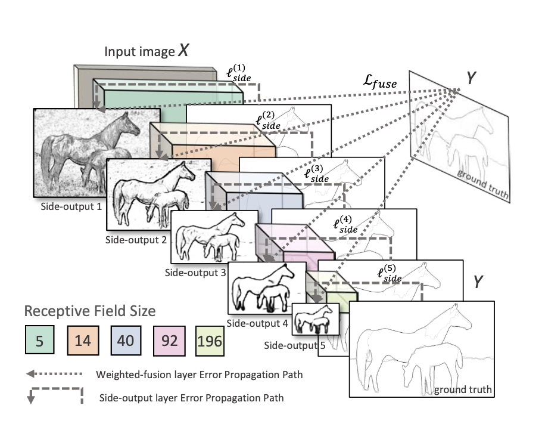
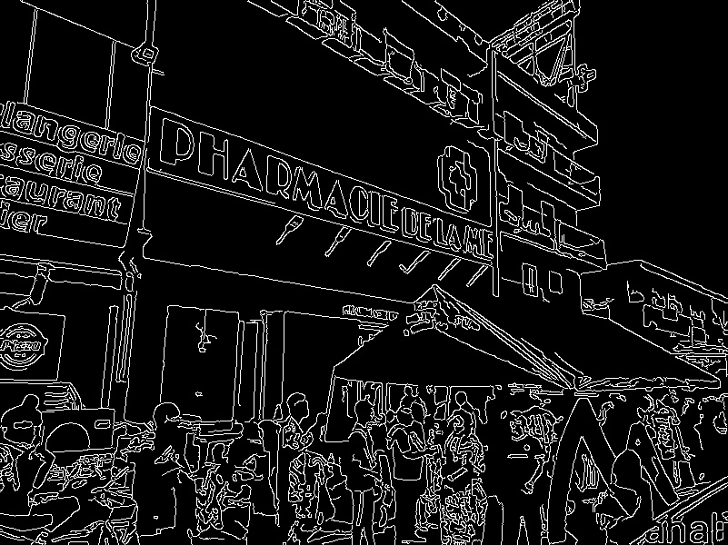

# Edge Detection Module

The edge detection module aims to transforme a raw RGB image to a binary structure map. Edge detection is a fundamental task in computer vision, and has attrated many research on it. The current methods can be mainly summarized to two categories:

1. Traditional edge detector, such as Canny and Sobel
2. Learing based model, such HED and RCF.

In our case, we want to preserve the most import structure since the total number of characters is limited to 140. We tried Canny and HED, and it turns out that HED works better for our case because it can automatically preserve the most important coarse-grained structures of the image while filtering the unimportant fine-grained textures.

## Environment Requirement

* OpenCV==4.5.2
* Python==3.7.0

We recommend to use [conda](https://www.anaconda.com/products/individual#Downloads) for environment management. You can install it on its official site.

Assume that you have installed conda proprely. You can use the following instructions to configure the environment.

1. Creat environment

   You can choose to create your own environment for this specific application. If you want to run it directly in the *base* environment, please skip to step 2.

   ```bash
   # create a new environment
   conda create -n your_env
   # activate your new environment
   conda activate your_env
   ```

2. Install packages

   In the environment just created, you can install the required packages using the following instructions in the shell/cmd.

   ```bash
   conda install python==3.7
   pip install opencv-python
   ```

3. Check installation

   You can check the installing results via the following commands.

   ```bash
   # enter into the python command line mode
   % python
   ```

   Normally, you should be in the python environment, inpliciting the Python version number in the terminal. In the interactive Python environment, input the following code.

   ```python
   >>> import cv2 as cv
   >>> cv.__version__
   ```

   If there is no error raised, then you have configured the environment correctly.

## Canny

### Introduction

Canny is a tradition multi-stage algorithm for edge detection proposed in 1986, named after its inventor John F.Canny. The resulting edge map can be controlled by a number of adjustable parameters. You can find more details in the original [paper](https://ieeexplore.ieee.org/abstract/document/4767851).

### Usage

The code is implemented in canny.py

```Python
import cv2 as cv

# input the path of your own image here
image = cv.imread('./images/test_image.jpg')
gray = cv.cvtColor(image, cv.COLOR_BGR2GRAY)
blurred = cv.GaussianBlur(gray, (5, 5), 0)
# change the lower and upper value of canny here
canny = cv.Canny(blurred, 30, 150)

cv.imshow('Input', image)
cv.imshow('Canny', canny)
cv.waitKey(0)
```

After runing the previous program canny.py via the following instruction

```python
% python canny.py
```

You can see the result of Canny detector on your screen. You can tap an arbitary key to quit the program.

## HED

### Introduction

Holistically-Nested Edge Detection (HED) is proposed by Xie et al in ICCV'15. It is proposed to handle the shortcomings of Canny detector. Inspired by FCN and pretrained VGGNet, HED is an end-to-end convolution neural network. The overall network architecture is illustrated in the following figure.



<center>HED architecture illustration</center>

During training, it utilizes the output of all convolution layers to do a deep supervision. Hence, it can capture the hierachical structure information in the image. By the time, they achieved the SOTA performance on BSD500 dataset, with an ODS F-score of 0.782. For more detail, please read the original [paper](https://arxiv.org/abs/1504.06375).

### Usage

Thanks to the DNN module by OpenCV, we can easily deploy the HED model in our application. The code is implemented in hed.py. 

We used the pretrained HED model open sourced by the author on GitHub, written in Caffe. For more information, please refer to [s9xie/hed](https://github.com/s9xie/hed). The pretrained model architecture and parameters can be downloaded respectively on the following sites.

1. Model architecture: [deploy.prototxt](https://github.com/s9xie/hed/blob/master/examples/hed/deploy.prototxt)

2. Model parameters: [hed_pretrained_bsds.caffemodel](http://vcl.ucsd.edu/hed/hed_pretrained_bsds.caffemodel)

```Python
import cv2 as cv

class CropLayer(object):
    def __init__(self, params, blobs):
        self.xstart = 0
        self.xend = 0
        self.ystart = 0
        self.yend = 0

    def getMemoryShapes(self, inputs):
        inputShape, targetShape = inputs[0], inputs[1]
        batchSize, numChannels = inputShape[0], inputShape[1]
        height, width = targetShape[2], targetShape[3]

        self.ystart = (inputShape[2] - targetShape[2]) // 2
        self.xstart = (inputShape[3] - targetShape[3]) // 2
        self.yend = self.ystart + height
        self.xend = self.xstart + width
        return [[batchSize, numChannels, height, width]]

    def forward(self, inputs):
        return [inputs[0][:,:,self.ystart:self.yend,self.xstart:self.xend]]

cv.dnn_registerLayer('Crop', CropLayer)

# Load the model, please change the path accordingly
net = cv.dnn.readNet("./models/hed/deploy.prototxt", "./models/hed/hed_pretrained_bsds.caffemodel")

kWinName = 'Holistically-Nested Edge Detection'
cv.namedWindow('Input', cv.WINDOW_AUTOSIZE)
cv.namedWindow(kWinName, cv.WINDOW_AUTOSIZE)

frame = cv.imread("./images/test_image.jpg")
cv.imshow('Input', frame)

inp = cv.dnn.blobFromImage(frame, scalefactor=1.0, size=(500, 500),
                           mean=(104.00698793, 116.66876762, 122.67891434),
                           swapRB=False, crop=False)
net.setInput(inp)
out = net.forward()
out = out[0, 0]
out = cv.resize(out, (frame.shape[1], frame.shape[0]))

# save the hed result to the target path
cv.imwrite("images/hed.jpg", out*255)
cv.imshow(kWinName, out)

cv.waitKey(0)
```

After runing the program hed.py by the following instruction:

```bash
% python hed.py
```

 The structure map by HED will be saved at the given path, you can also see the result on your screen. You can tap an arbitary key to quit the program.

## Results

We download an image chosen arbitrarily from internet, with both text and logo on the wall of the store.


<center>The original image</center>

### Canny

We use Canny to do the contours detection, with parameters carefully chosen: lower_bound = 30, upper_bound = 150. And we get the following result.



<center>Structure map by Canny, with lower bound = 30, upper bound = 150</center>

We observed a lot of texture details in the resulting edge map, which we want to inhibit. So we change the parameters manually, and choose a suitable one, with lower_bound = 150, upper_bound = 250. The resulting structure map is as follows:


<center>Structure map by Canny, with lower bound = 150, upper bound = 250</center>

We can see that the details are filtered. Only the main structure is preserved. But there are many breaking points in the structure line. And it's hard to choose the adaptive parameters for different images. 

### HED

We use the HED model to do the edge detection and get directly the following result.


<center>Structure map by HED</center>

We can see that the HED can well preserve the structure line of the image while filtering many fine-grained texture in the original images. And we don't need manually choose the appropriate parameters.

## Conclusions

We compared two types of models for edge detection: the traditional method (Canny) versus the learning-based method (HED). The results show that the deep learning model (HED) is more appropriate to our application since it can *automatically* extract the hierachical structure of the image and filter noise. The Canny detector can also meet this demande, but it need *manually* tuning the parameters and the results aren't so appeling in contrast to HED. Hence, we will use HED in priority to perform the edge detection function in our system.

## References

1. https://github.com/opencv/opencv/blob/master/samples/dnn/edge_detection.py
2. Xie S, Tu Z. Holistically-nested edge detection[C]//Proceedings of the IEEE international conference on computer vision. 2015: 1395-1403.
3. Canny J. A computational approach to edge detection[J]. IEEE Transactions on pattern analysis and machine intelligence, 1986 (6): 679-698.
4. https://www.psyangji.com/15209.html